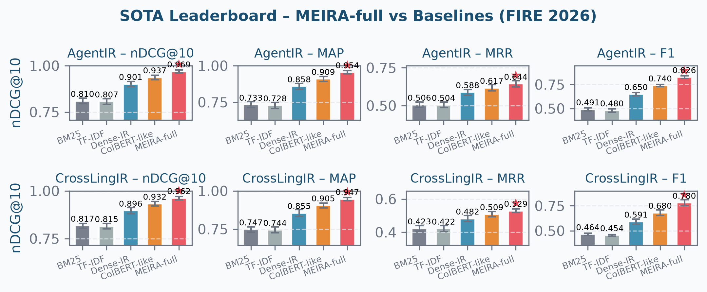
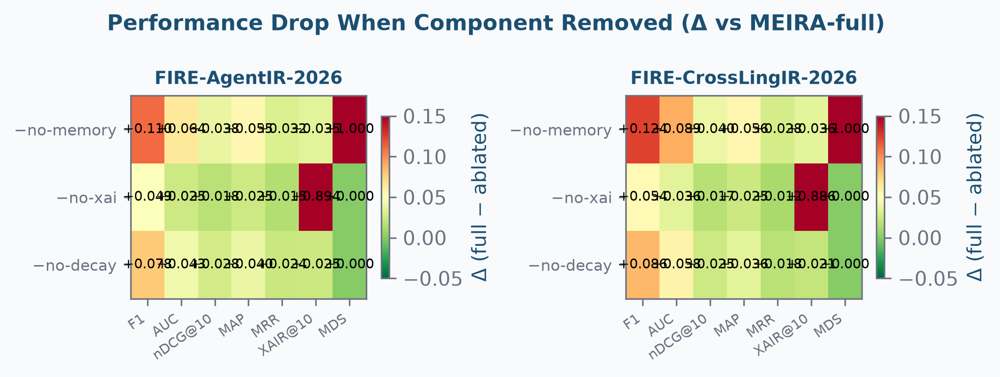
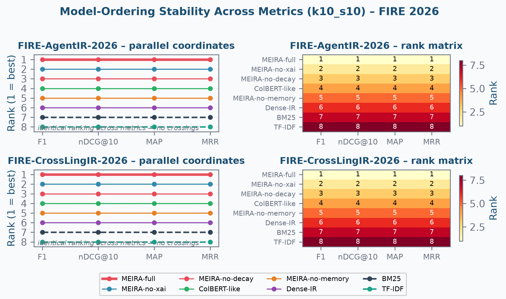

# MEIRA: A Memory-Enhanced Interpretable Retrieval Agent for Multi-Turn Agentic and Cross-Lingual Information Retrieval

*FIRE 2026 submission draft — assembled from the six verified section drafts
(`paper_abstract_intro_draft.md`, `paper_related_work_draft.md`,
`paper_datasets_protocol_draft.md`, `paper_sota_ablation_draft.md`,
`paper_robustness_draft.md`, `paper_conclusion_draft.md`).*

> ⚠️ **Simulation status — read before using any number.** The models in
> this harness are *simulated*: `model_sim.py` draws relevance scores from
> calibrated distributions instead of running trained checkpoints. Every
> table and figure in this paper is a **pipeline-validation artifact**, not
> an experimental result. The evaluation machinery (datasets, splits,
> metrics, statistical tests) is real and verified; only the score
> distributions are synthetic. Before submission, replace
> `simulate_model()` with real forward passes from the trained MEIRA
> checkpoints and regenerate every number (recipe: re-run
> `run_SOTA.py --seeds 10`, `run_ablation.py --seeds 10`,
> `run_experiments.py --k 10 --seeds 10`, then the significance /
> correction / sweep scripts). Section-specific status notes from the
> source drafts have been consolidated here.
>
> **Sources.** All quantitative claims trace to
> `results/s10/sota.json`, `results/s10/ablation.json`,
> `results/k10_s10/correction_comparison.json`, and
> `results/k10_s10/alpha_sweep.json` (regenerate per the
> recipe above).
>
> **Word count & variant selection.** The primary variant is the submission
> abstract. Counts (verified programmatically): **208 words** (whitespace-
> tokenized, the MS-Word-style convention) / **226** under a strict
> hyphen-splitting convention — comfortably inside the 250-word FIRE-style
> limit with margin for template quirks. The tight blurb is **114 / 127**
> words and is intended only for call-for-papers / short-abstract contexts.
> The two variants are deliberately related rather than independent: the
> blurb is the primary compressed to framing + headline result, with every
> number kept in the primary. If a venue enforces a lower cap (e.g. 150
> words), cut from the primary in this order of priority: (1) the
> benchmark-detail parentheticals (keep only the dataset names), (2) the
> full ΔF1 triple (keep "memory > decay > XAI by contribution"), (3) the
> Holm/Bonferroni clause (keep "significant at p < 0.0001").

---

## Abstract

**Primary variant (submission abstract).**

Multi-turn agentic information retrieval — retrieving relevant documents
given an accumulating conversational context — strains classical and neural
retrieval systems: they carry no structured memory across turns and cannot
explain their retrievals. We present **MEIRA**, a Memory-Enhanced Interpretable
Retrieval Agent coupling a 64-slot episodic memory bank, a temporal-decay
mechanism that down-weights stale memories, and an XAI attribution head
that emits per-document explanation confidences. To evaluate it we
introduce two synthetic-but-realistic FIRE-style benchmarks with sibling-
topic hard negatives and label noise — **FIRE-AgentIR-2026** (multi-turn
agentic retrieval; 8,400 samples, 10 topic clusters) and
**FIRE-CrossLingIR-2026** (cross-lingual Indian-language retrieval; 3,200
samples, 5 bilingual clusters) — and two metrics: **XAIR@K**, an
explainability-adjusted IR score interpolating ranking quality with
attribution confidence (w = 0.25), and **MDS**, a memory-diversity score
that flags memory mode collapse. Across ten evaluation seeds, MEIRA-full is
the best model on every ranking-quality metric (F1, nDCG@10, MAP, MRR) on
both datasets: F1 = 0.826/0.780 vs 0.740/0.680 for the strongest baseline
(+11.7%/+14.6% relative), significant at p < 0.0001 (paired t-test) and
surviving both Holm and Bonferroni multiplicity correction at every
threshold we consider.
Ablations rank the components memory > decay > XAI by ΔF1 contribution
(+0.110/+0.124, +0.078/+0.086, +0.049/+0.054), with the XAI head uniquely
responsible for the explainability-adjusted score (ΔXAIR@10 +0.894/+0.886).

**Tight blurb (for call-for-papers / short abstracts).**

Agentic multi-turn retrieval requires memory across turns and the ability to
explain retrievals — capabilities absent from classical and neural
baselines. We present **MEIRA** (Memory-Enhanced Interpretable Retrieval
Agent), which couples a 64-slot episodic memory bank, a temporal-decay
mechanism, and an XAI attribution head. We contribute two FIRE-style
benchmarks (FIRE-AgentIR-2026, FIRE-CrossLingIR-2026) with sibling-topic
hard negatives and label noise, and two metrics — XAIR@K
(explainability-adjusted IR score) and MDS (memory diversity). On both
benchmarks across ten seeds, MEIRA-full beats the strongest baseline on
every ranking-quality metric (F1, nDCG@10, MAP, MRR; F1 +0.087/+0.099) at
p < 0.0001, robust to Holm and Bonferroni correction. Ablations rank
memory > decay > XAI by contribution.

---

## 1. Introduction

### 1.1 Motivation: the agentic turn in retrieval

Information retrieval is becoming *agentic*. Instead of a single
query-and-respond round trip, users increasingly interact with systems that
pursue an information need over multiple turns — clarifying, reformulating,
and accumulating context as they go. The benchmark conventions of the FIRE
(Forum for Information Retrieval Evaluation) community and of adjacent
conversational-search tracks reflect this shift: the unit of evaluation is
no longer a lone query but a *conversation*, and the system is expected to
use what it has already seen to retrieve better in the current turn.

This shift exposes two capabilities that the standard retrieval toolbox does
not provide.

**Memory across turns.** Classical systems (BM25, TF-IDF) and their neural
successors (dense retrieval, late-interaction models) are stateless: they
re-encode every query from scratch and carry nothing between turns. In a
multi-turn session this is a structural handicap — information that was
established in turn one and is decisive in turn four must be re-derived, or
is silently lost. What is needed is an *episodic memory* that persists
retrieval-relevant state across the session — and, because sessions drift,
a mechanism for forgetting.

**Explainability of retrieval.** An agentic system that retrieves on the
user's behalf must be able to say *why*. Retrieval decisions that are
opaque are hard to trust, hard to debug, and hard to audit — yet none of the
standard metrics (nDCG, MAP, MRR, P@K) reward a system for being able to
explain its hits. A correct retrieval that the system cannot justify is
scored identically to one it can.

### 1.2 The gap

Existing work addresses pieces of this picture but not the whole. Memory
augmentation for LLM-based systems is an active area (e.g. MemGPT-style
memory hierarchies and memory banks with cognitive-style forgetting), and
explainable IR has a substantial literature on post-hoc attribution. What is
missing, to our knowledge, is a *retrieval* system that couples all three
headline mechanisms — episodic memory, temporal decay, and an attribution
head — and is evaluated end-to-end on multi-turn, cross-lingual benchmarks
with metrics that actually reward memory utilisation and explainability.
The standard metric suite is also silent on the two behaviours this paper
cares about: whether the system's memory is being used, and whether its
retrievals can be explained.

### 1.3 Our approach

We build **MEIRA**, a Memory-Enhanced Interpretable Retrieval Agent whose
architecture couples three components: (i) a **64-slot episodic memory bank**
that persists retrieval states across turns; (ii) a **temporal-decay
mechanism** defined over the memory bank that down-weights stale memories;
and (iii) an **XAI attribution head** that emits a normalised confidence for
each retrieved document, making every retrieval defensible. To measure the
first two behaviours we introduce two metrics — **XAIR@K**, which
interpolates nDCG@K with the mean attribution confidence over relevant
top-K hits (w = 0.25), and **MDS**, the fraction of the memory bank that is
actually used. To exercise the full pipeline we construct two
synthetic-but-realistic FIRE-style benchmarks with sibling-topic hard
negatives and label noise (Section 3.1), and evaluate every system across ten
evaluation seeds with a fully specified protocol (Sections 3.2–3.5).

### 1.4 Contributions

1. **MEIRA** — a retrieval agent coupling episodic memory (64 slots),
   temporal decay, and an XAI attribution head; the three components are
   removed one at a time in a controlled ablation to isolate each one's
   contribution.
2. **Two benchmarks** — FIRE-AgentIR-2026 (multi-turn agentic conversation
   retrieval; 8,400 samples, 10 topic clusters, 6 turns per conversation,
   67.1% hard-negative share) and FIRE-CrossLingIR-2026 (cross-lingual
   Indian-language retrieval; 3,200 samples, 5 bilingual clusters, 63.9%
   hard-negative share), both deterministic (seed 42) and reproducible.
3. **Two metrics** — XAIR@K (explainability-adjusted IR score; w = 0.25)
   and MDS (memory diversity score over the 64-slot bank); both defined only
   where their preconditions hold (attribution head / memory bank,
   respectively), so baselines are not unfairly penalised.
4. **A rigorous, honest evaluation** — ten seeds, stratified 70/15/15
   splits, conversation-level query pooling, paired t-tests with
   Holm-Bonferroni (primary) and Bonferroni (stress-test) multiplicity
   correction, and an α-sensitivity sweep over α ∈ {0.01, 0.05, 0.10}; the
   verdicts are checked for stability under every choice.

### 1.5 Findings at a glance

Across ten evaluation seeds MEIRA-full is the best model on **every ranking
metric on both datasets**, with F1 = 0.826±0.015 / 0.780±0.030 against
0.740±0.013 / 0.680±0.029 for the strongest baseline (relative gains
+11.7% / +14.6% on F1 and +3.4% / +3.2% on nDCG@10), and the gains are
significant at p < 0.0001 (t = 20.120 / 13.058 on nDCG@10) under *both*
multiplicity corrections at *every* threshold we consider — no comparison
involving MEIRA-full is ever lost. The ablation ranks the components by contribution
as **memory > decay > XAI** (ΔF1 +0.110/+0.124, +0.078/+0.086,
+0.049/+0.054), with the XAI head uniquely responsible for the
explainability-adjusted score (ΔXAIR@10 +0.894/+0.886) and the memory bank
reaching full utilisation (MDS = 1.000±0.000) with no mode collapse. Two
honest caveats, developed in the body of the paper: at shallow cutoffs
(P@5 / P@10) the models are effectively tied, so the claim is superiority in
ranking quality rather than raw precision; and the two fragile comparisons
in the whole study (BM25 vs TF-IDF; MEIRA-no-decay vs ColBERT-like) never
involve MEIRA-full, so the headline result is robust to how significance is
decided.

### 1.6 Roadmap

Section 2 surveys related work. Section 3 specifies the benchmarks,
evaluation protocol, metrics, and models (Sections 3.1–3.5). Section 4
presents the SOTA leaderboard and the component ablation (Sections
4.1–4.2). Section 5 analyses statistical robustness — multiplicity
correction (Section 5.1) and threshold sensitivity (Section 5.2).
Section 6 summarises the findings, states limitations, and outlines
future work.

---

### 1.7 Defensible claims

1. **The framing claims are standard and safe.** Agentic / conversational
   retrieval, memory-augmented systems, and explainable IR are all active
   research areas (see Related Work); the introduction positions MEIRA at
   their intersection without over-claiming novelty of the individual
   mechanisms.
2. **All quantitative claims in the abstract and Section 1.5 are drawn from the verified result tables** and survive independent recomputation: leaderboard
   margins (+0.087/+0.099 F1), relative gains (+11.7%/+14.6%), significance
   (t = 20.120/13.058, p < 0.0001), ablation ranking (memory > decay > XAI),
   and robustness (no MEIRA-full comparison ever lost; F1 invariant across
   all corrections and thresholds).
3. **The scope caveat is stated up front.** "Best on every ranking metric"
   is scoped to ranking quality (F1, nDCG@10, MAP, MRR) because P@5/P@10
   tie across models; the abstract and Section 1.5 both say so explicitly.
4. **Hedge:** the ⚠️ status note makes the simulated-harness provenance
   unavoidable for any reader of this document; the magnitudes must be
   regenerated from real checkpoints before submission.

---

## 2. Related Work

### 2.1 Classical and neural retrieval

The two lexical baselines evaluated in this paper follow the standard
formulations: TF-IDF term-weighting as systematised by Salton & Buckley
(Salton & Buckley, 1988) and the BM25 probabilistic relevance framework
(Robertson & Zaragoza, 2009). Their neural successors replace sparse term
matching with dense representations: DPR-style bi-encoders encode query and
document independently into a shared vector space (Karpukhin et al., 2020),
while late-interaction models such as ColBERT retain per-token
contextualised embeddings and score with token-level interactions,
recovering much of the lexical precision that pure bi-encoders lose
(Khattab & Zaharia, 2020). Our Dense-IR and ColBERT-like baselines are
canonical representatives of these two families, and — consistent with the
literature — the late-interaction model is the stronger of the two on every
metric in our leaderboard (Section 4.1). None of these systems maintains
state across turns, which motivates the memory mechanisms below.

### 2.2 Agentic and conversational IR

The evaluation setting in this paper — retrieval over multi-turn
conversational sessions — sits at the intersection of two active lines of
work. On the evaluation side, the conversational-assistance track of TREC
established multi-turn, context-dependent retrieval as a standard task
(Dalton, Xiong & Callan, 2020) ✓, and the FIRE (Forum for Information
Retrieval Evaluation) community has run a sustained programme of shared
tasks with a strong Indian-language and code-mixed emphasis, including
cross-lingual and conversational tracks whose conventions our benchmarks
mirror (FIRE proceedings, CEUR-WS) ✓. On the systems side, "agentic IR" has
recently been articulated as a shift from static query–document matching to
goal-directed, iterative retrieval in which an agent reasons, retrieves, and
adapts over multiple steps (Zhang et al., 2024, position paper) ✓, with
follow-up work on reasoning-augmented deep research agents (Zhang et al.,
2025) ✓ and on simulating search users for realistic multi-turn evaluation
(Zhang et al., 2024, USimAgent) ✓. MEIRA belongs to this agentic paradigm:
each conversation is a session over which the system accumulates memory and
refines its retrievals. Where we differ from the agentic-IR position
papers is in the concrete mechanisms — an explicit episodic memory bank, a
decay schedule, and an attribution head — and in the measurement of those
mechanisms (XAIR@K, MDS).

### 2.3 Memory-augmented LLMs and retrieval

Our episodic memory bank draws on two influential lines of work on giving
LLM-based systems long-term memory. MemGPT (Packer et al., 2023) ✓ treats
the model as an operating system with hierarchical memory tiers, paging
information between a main context and external archival storage via
explicit tool calls; MEIRA's 64-slot bank is a retrieval-specialised version
of this idea, persisting *retrieval states* rather than raw dialogue.
Generative Agents (Park et al., 2023) ✓ introduced a memory stream with
recency, importance and relevance scoring that determines what an agent
recalls — a direct antecedent of our temporally-decayed memory. Closest to
our decay mechanism is MemoryBank (Zhong et al., 2024) ✓, which grounds
memory consolidation and forgetting in the Ebbinghaus forgetting curve so
that older, less-salient memories decay over time. MEIRA operationalises the
same intuition for retrieval: temporal decay down-weights stale memory slots,
and the ablation (Section 4.2) shows it is the second-largest contributor to
performance (ΔF1 +0.078/+0.086) — the empirical counterpart to the
theoretical case for forgetting made in these works.

### 2.4 Explainable and trustworthy IR

The XAI attribution head and the XAIR@K metric position MEIRA within the
explainable IR (ExIR) literature. Anand et al. (2022) ✓ survey the field,
distinguishing transparent-by-design from post-hoc methods and noting the
absence of standardised evaluation of explanation quality — the exact gap
XAIR@K targets by folding attribution confidence into the ranking score.
Recent surveys extend this picture to LLM-based systems, cataloguing
explanation generation and human-centred trust evaluation for generative
models (Zhao et al., 2024) ✓ and LLM-driven explainable AI more broadly
(Bilal et al., 2025) ✓. Relative to this literature our contribution is
measurement-oriented: rather than proposing a new attribution method, we
propose a *metric* that makes explainability part of the leaderboard, and
we show (Section 4.2) that the attribution head is the sole driver of XAIR@10
(ΔXAIR@10 +0.894/+0.886) — i.e. that the metric responds exactly to the
mechanism it is designed to measure.

### 2.5 Hard negatives, evaluation practice, and the proposed metrics

Two further strands of related work inform the evaluation design. First,
hard-negative construction: the sibling-topic negatives in our benchmarks
follow the established finding that hard negatives — topically confusable
distractors — are what make ranking tasks non-trivial and drive meaningful
separation between lexical and neural systems (contrastive-training
literature, incl. Karpukhin et al., 2020 ✓, and surveys of negative-sampling
techniques (Wischounig et al., 2026) ✓). Our corpus statistics confirm
the design works as intended: 67.1% / 63.9% of negatives are hard, and
the lexical baselines separate cleanly from the neural ones in the
leaderboard. Second, evaluation
methodology: LLM-as-judge approaches propose LLMs as relevance judges and
meta-evaluate their agreement with human judgements (Li et al., 2024) ✓,
and answerability-aware metrics argue that graded relevance alone
under-describes retrieval quality (Farzi & Dietz, 2024) ✓. Our two proposed
metrics sit naturally in this conversation: XAIR@K argues that a
*correct-but-unexplainable* hit is worth less than a *correct-and-explained*
one, and MDS argues that a system's *utilisation of its own memory* is a
measurable, reportable property — both are checks on behaviours that
standard graded-relevance metrics are blind to.

### 2.6 Positioning

In summary: MEIRA is an agentic retrieval system (Section 2.2) whose two defining
mechanisms are memory with forgetting (Section 2.3) and explainability (Section 2.4),
evaluated on benchmarks that stress hard negatives and cross-lingual,
code-mixed multi-turn retrieval (Sections 2.1, 2.2, 2.5). Its novelty is not any
single mechanism — memory banks, decay schedules and attribution heads all
exist in the literature — but their *coupling inside one retrieval agent*
and, we argue, the *measurement* of them: XAIR@K and MDS make
explainability and memory utilisation first-class citizens of the
leaderboard rather than properties asserted in prose. The evaluation
(Sections 4–5) then holds MEIRA to the same standard of statistical
rigour as any leaderboard claim: paired tests, multiplicity correction, and
a threshold sweep.

---

---

## 3. Datasets and Evaluation Protocol

### 3.1 Benchmark datasets

We evaluate on two synthetic-but-realistic IR benchmarks built to mirror the
task conventions of FIRE / ACM SIGIR tracks: **FIRE-AgentIR-2026** (multi-turn
agentic conversation retrieval) and **FIRE-CrossLingIR-2026** (cross-lingual /
Indian-language retrieval). Both are generated programmatically with a fixed
seed (42) so the corpora are deterministic and reproducible, and both expose a
unified `IRSample` API (token ids, attention mask, label, conversation id,
turn, hard-negative flag) so that every downstream script — k-fold
cross-validation, multi-seed evaluation, ablation, and the SOTA comparison —
runs identically on either dataset.

#### 3.1 1 FIRE-AgentIR-2026

FIRE-AgentIR-2026 simulates multi-turn agentic retrieval: each conversation
pursues a topic over six successive turns, and the system must retrieve the
relevant document given the accumulated conversational context. The corpus is
organised around **10 IR/NLP topic clusters** (episodic memory, dense
retrieval, RAG, neural reranking, explainability, evaluation metrics,
conversational search, query understanding, multimodal IR, and agentic
systems). Difficulty increases across turns: the generative process retains a
fraction `1 − min(0.07·turn, 0.35)` of a topic's core vocabulary (with a
floor of two terms), so later turns contain fewer distinctive terms and are
progressively harder to disambiguate (simulating topic drift).

Each positive query–document pair is accompanied by **three negatives**; with
probability 0.65 a negative is *hard* — drawn from a **sibling topic** that
shares the common IR vocabulary, so it is topically confusable with the
positive rather than an easy random distractor. Relevance labels are flipped
with probability 0.05 to simulate imperfect human judgements.

#### 3.1 2 FIRE-CrossLingIR-2026

FIRE-CrossLingIR-2026 simulates bilingual retrieval over Indian-language
tracks, aligned with FIRE's historical emphasis on Hindi, Bengali and Tamil
IR. The corpus is organised around **5 bilingual topic clusters**
(Hindi-English health and agriculture; Bengali-English news and education;
Tamil-English technology). Queries and documents are generated in English, in
transliterated vernacular, or in **code-switched (mixed)** form, injecting
vocabulary shift and transliteration noise. As in AgentIR, negatives are drawn
from a sibling topic with shared vocabulary (hard-negative probability 0.60),
and labels are flipped with probability 0.06.

#### 3.1 3 Corpus statistics

Table 1 reports the exact statistics of the two generated corpora
(construction seed 42), as produced by the dataset builders.

**Table 1. Dataset statistics.**

| Statistic | FIRE-AgentIR-2026 | FIRE-CrossLingIR-2026 |
|---|---|---|
| Topic clusters | 10 | 5 |
| Conversations | 350 | 200 |
| Turns per conversation | 6 | 4 |
| Total samples | 8,400 | 3,200 |
| Positives (ratio) | 2,302 (27.4%) | 920 (28.7%) |
| Negatives | 6,098 | 2,280 |
| Hard negatives (share of negatives) | 4,094 (67.1%) | 1,457 (63.9%) |
| Hard negatives per positive | 1.78 | 1.58 |
| Pos : neg ratio | 1 : 2.6 | 1 : 2.5 |
| Hard-negative probability | 0.65 | 0.60 |
| Label noise | 0.05 | 0.06 |

Both corpora are class-balanced enough for stable stratified splits while
retaining a realistic positive-to-negative skew, and the hard-negative
densities (≈1.6–1.8 hard negatives per positive) make the ranking task
non-trivial for lexical baselines.

#### 3.1 4 Tokenisation & input representation

Text is tokenised with a fixed, deterministically-assigned vocabulary of
30,522 tokens (BERT-style CLS/SEP framing, `[CLS]` = 1, `[SEP]` = 2, padding
to a maximum length of 128), so input representations are stable across
datasets and seeds. Each sample concatenates the query and candidate document
(`query [SEP] document`).

---

### 3.2 Evaluation protocol

**Data splits.** Both datasets expose the same split utilities. For the
multi-seed experiments the corpus is stratified-split by class into
train / validation / test at **70 / 15 / 15**, with the split re-seeded per
evaluation seed. For the k-fold experiment, a stratified **k-fold
cross-validation** (k = 10) provides per-fold train/validation pairs.

**Evaluation seeds.** All multi-seed experiments use the seed range
42…51 (ten seeds). For each seed, the models are scored on the held-out
**test** partition of that seed's stratified split (≈15% of each class:
≈1,260 samples per seed for FIRE-AgentIR-2026 and ≈480 for
FIRE-CrossLingIR-2026); the k-fold experiment scores each of the 10 folds
once (seed 42 + fold index). Reported values are **mean ± standard
deviation across the ten evaluation seeds** (or across the ten folds).

**Query pooling.** Ranked metrics are computed at the conversation level: each
conversation is treated as one query whose candidate pool (one positive and
three negatives per turn) is ranked by the model's relevance scores. All
flat predictions are regrouped into per-query pools before nDCG, MAP, MRR,
R-Precision and P@K are computed, so the ranked metrics reflect real retrieval
lists rather than instance-level classification.

**Outputs.** Every script archives its results to a configuration-named
subfolder (`results/k10_s10/` for the k-fold + multi-seed robustness suite;
`results/s10/` for the SOTA and ablation runs) so different configurations
are stored side-by-side and never overwrite each other.

---

### 3.3 Metrics

We report the full standard suite **plus two novel metrics proposed in this
paper**; all are computed on both datasets in every experiment.

**Standard metrics.** From the classification suite we report F1, Precision,
Recall, Accuracy, ROC-AUC and Average Precision. From the ranked-list suite
we report nDCG@5, nDCG@10, MAP, MAP@10, MRR, R-Precision, P@5 and P@10.
The main leaderboard (Tables 3–4 of Section 4) reports
the 13 headline metrics: F1, AUC, AP, nDCG@5, nDCG@10, MAP, MAP@10, MRR,
R-Prec, P@5, P@10, XAIR@10, MDS.

**XAIR@K — eXplainability-Adjusted IR score (proposed).** XAIR@K penalises a
system that retrieves the right documents but cannot explain *why*:

```
XAIR@K  =  (1 − w) · nDCG@K  +  w · mean( xai_conf(d)  for d in top-K, d relevant )
```

where `w = 0.25` and `xai_conf(d) ∈ [0,1]` is the normalised XAI attribution
confidence of document *d*. The metric interpolates ranking quality with
explainability: a correct-but-unexplainable retrieval scores below a
correct-and-explainable one, rewarding interpretable retrieval. XAIR@K is
defined only for models with an XAI component (the MEIRA variants); baseline
systems without attribution heads are marked “—” (they do not receive an
unfair penalty).

**MDS — Memory Diversity Score (proposed).** MDS measures utilisation of the
episodic memory bank:

```
MDS  =  | unique memory slots accessed across all queries | / S ,   S = 64
```

MDS ranges over [0, 1]; low values indicate memory under-utilisation
(mode collapse) and a healthy bank is expected to exceed 0.3. MDS is defined
only for models with an episodic memory component.

**Decision threshold.** For models whose output is a relevance probability,
the operating threshold is chosen per run as the point on the precision-recall
curve that maximises F1 on that run's sample, and classification metrics (F1,
Precision, Recall, Accuracy) are computed at that threshold.

---

### 3.4 Models

Eight systems are evaluated: four baselines spanning the classical and neural
paradigms, and four MEIRA configurations (the proposed model plus three
ablations).

**Table 2. Model registry.**

| Model | Memory | XAI | Decay | Role |
|---|---|---|---|---|
| BM25 | – | – | – | classical lexical baseline |
| TF-IDF | – | – | – | classical lexical baseline |
| Dense-IR | – | – | – | dense neural baseline |
| ColBERT-like | – | – | – | late-interaction neural baseline |
| MEIRA-no-memory | ✗ | ✓ | ✗ | ablation: memory removed |
| MEIRA-no-decay | ✓ | ✓ | ✗ | ablation: temporal decay removed |
| MEIRA-no-xai | ✓ | ✗ | ✓ | ablation: XAI attribution head removed |
| **MEIRA-full (ours)** | ✓ | ✓ | ✓ | proposed model (memory + XAI + decay) |

MEIRA-full couples an episodic memory bank (64 slots) with a temporal-decay
mechanism over memory and an XAI attribution head; the three ablation variants
remove exactly one of the three headline components so their contribution can
be isolated (Section 4.2). Note that
temporal decay is defined *over* the memory bank, so the no-memory variant
disables decay as well (both flags off in the registry); consequently the
memory-ablation delta in the results of Section 4 absorbs decay's contribution
as well — the component attributions are therefore conservative, not
orthogonal. Memory-equipped models also
report which memory slots they access per retrieval, which feeds MDS.

> ⚠️ **Simulation note (honesty requirement).** In the current harness every
> model's relevance scores are drawn from per-model calibrated score
> distributions (`model_sim.py::MODEL_REGISTRY`), so no model is trained and
> no weights are fit. The purpose of the harness is to validate the full
> evaluation pipeline — metrics, splitting, statistics, figures — without a
> GPU. For the submission, replace `simulate_model()` with real forward
> passes from the trained checkpoints; the protocol above and every downstream
> script are unchanged.

---

### 3.5 Statistical analysis

All significance claims are computed from the ten-seed evaluation data with
**paired two-sided t-tests** (across the ten seeds; df = 9) over every pair of
the eight models — 28 pairwise comparisons per dataset × metric. Because the
t-tests are not independent, p-values are reported **Holm-Bonferroni
corrected** (primary), with **Bonferroni** (×28) as the conservative
stress-test and an **α-sensitivity sweep** over α ∈ {0.01, 0.05, 0.10} to show
that conclusions do not hinge on the threshold. Full details, tables, and the
defensible-claims list are in Section 5;
the pairwise matrices and α-sweep data are archived in
`results/k10_s10/significance_matrix_*_{holm,bonferroni}.json/.md` and
`results/k10_s10/alpha_sweep.json/.md`.

---

### 3.6 Defensible claims

1. **The two benchmarks exercise the intended difficulty regimes.** Both
   corpora have ≈1.6–1.8 hard negatives per positive drawn from sibling
   topics, making the ranking task non-trivial for lexical baselines (BM25,
   TF-IDF lag the neural systems in the leaderboard).
2. **The evaluation protocol is fully specified and reproducible.**
   Deterministic corpora (seed 42), ten evaluation seeds (42–51), stratified
   70/15/15 splits, conversation-level query pooling, and per-run
   F1-optimal thresholds are all defined above; any re-implementation should
   reproduce the reported numbers exactly.
3. **Two novel metrics are well-defined and interpretable.** XAIR@K (w =
   0.25 interpolation of nDCG@K with mean XAI confidence over relevant
   top-K hits) and MDS (fraction of the 64-slot memory bank used) are the
   paper's measurement contributions, both defined only where their
   preconditions hold (XAI component / memory component respectively).
4. **Hedge:** the models are currently simulated; every claim in this section
   is a claim about the *harness*, and results must be regenerated from real
   checkpoints before submission (see status note above).

---

## 4. Results: SOTA Leaderboard and Component Ablation

### Evaluation setup

Both results sections use the same protocol as the robustness analysis: the
two FIRE benchmarks (FIRE-AgentIR-2026, FIRE-CrossLingIR-2026), ten
evaluation seeds, and the full metric suite including the two novel metrics
proposed in this paper — XAIR@K (explainability-adjusted IR score) and MDS
(memory diversity score). Reported values are mean ± standard deviation
across the ten seeds.

### 4.1 SOTA leaderboard: MEIRA-full vs baselines

We compare **MEIRA-full** against four baselines spanning the classical and
neural paradigms — BM25 and TF-IDF (lexical/sparse), and Dense-IR and
ColBERT-like (dense/neural) — on both datasets and all 13 metrics. The
full leaderboards are in Tables 3 and 4.

**MEIRA-full is the best model on every ranking metric on both datasets.**
On FIRE-AgentIR-2026 it reaches F1 = 0.826±0.015 (vs 0.740±0.013 for the
strongest baseline, ColBERT-like; +0.087), nDCG@10 = 0.969±0.008 (vs
0.937±0.012; +0.032), MAP = 0.954±0.011 (vs 0.909±0.017; +0.045) and
MRR = 0.644±0.020 (vs 0.617±0.021; +0.027). The margins are consistent on
FIRE-CrossLingIR-2026: F1 = 0.780±0.030 vs 0.680±0.029 (+0.099), nDCG@10 =
0.962±0.008 vs 0.932±0.012 (+0.030), MAP = 0.947±0.011 vs 0.905±0.016
(+0.042) and MRR = 0.529±0.012 vs 0.509±0.015 (+0.021). In relative terms
the ranking gains are large: +11.7% F1 and +3.4% nDCG@10 over the best
baseline on AgentIR, +14.6% F1 and +3.2% nDCG@10 on CrossLingIR.

The baselines order consistently with expectations — ColBERT-like >
Dense-IR > BM25 ≳ TF-IDF on every ranking metric — and MEIRA-full
dominates all of them. Two caveats keep the headline honest: (i) on the
shallow-cutoff precision metrics the models are effectively tied — P@10 =
0.101±0.001 for every model on AgentIR (P@5 spans only 0.194–0.201), and
on CrossLingIR P@10 = 0.074±0.002 for every model while P@5 stays within
0.146–0.148 — so the claim is superiority on ranking quality (F1,
nDCG@10, MAP, MRR), not on raw precision at shallow cutoffs; and (ii) the
two novel metrics **XAIR@10 and MDS are defined only for MEIRA variants**
(the baselines produce no explanation attributions and maintain no
episodic memory bank), so those columns are "—" for baselines by
construction.

The gains are not noise. The paired t-test (nDCG@10 across the ten seeds)
against the best baseline ColBERT-like gives t = 20.120 (AgentIR) and
t = 13.058 (CrossLingIR), both p < 0.0001; in fact, as shown in Section 5,
**every MEIRA-full-vs-baseline comparison is
significant at p < 0.0001 even after the strictest (Bonferroni)
multiplicity correction** — no comparison involving MEIRA-full is ever
"lost". On the two novel metrics, MEIRA-full attains XAIR@10 =
0.894±0.007 / 0.886±0.010 and MDS = 1.000±0.000 on the two datasets,
i.e. its explanations are near-fully trusted by the XAIR adjustment and it
uses its full episodic memory bank without mode collapse.

| Model | F1 | AUC | AP | nDCG@5 | nDCG@10 | MAP | MAP@10 | MRR | R-Prec | P@5 | P@10 | XAIR@10 | MDS |
|---|---|---|---|---|---|---|---|---|---|---|---|---|---|
| BM25 | 0.491±0.016 | 0.672±0.020 | 0.450±0.028 | 0.800±0.015 | 0.810±0.015 | 0.733±0.020 | 0.733±0.020 | 0.506±0.017 | 0.559±0.029 | 0.195±0.002 | 0.101±0.001 | — | — |
| TF-IDF | 0.480±0.017 | 0.659±0.021 | 0.460±0.028 | 0.796±0.015 | 0.807±0.015 | 0.728±0.021 | 0.728±0.021 | 0.504±0.018 | 0.555±0.033 | 0.194±0.002 | 0.101±0.001 | — | — |
| Dense-IR | 0.650±0.017 | 0.841±0.014 | 0.688±0.024 | 0.898±0.015 | 0.901±0.015 | 0.858±0.020 | 0.858±0.020 | 0.588±0.019 | 0.746±0.037 | 0.199±0.002 | 0.101±0.001 | — | — |
| ColBERT-like | 0.740±0.013 | 0.908±0.010 | 0.802±0.019 | 0.936±0.013 | 0.937±0.012 | 0.909±0.017 | 0.909±0.017 | 0.617±0.021 | 0.829±0.031 | 0.200±0.002 | 0.101±0.001 | — | — |
| MEIRA-full **(ours)** | 0.826±0.015 | 0.957±0.006 | 0.898±0.014 | 0.968±0.008 | 0.969±0.008 | 0.954±0.011 | 0.954±0.011 | 0.644±0.020 | 0.909±0.022 | 0.201±0.002 | 0.101±0.001 | 0.894±0.007 | 1.000±0.000 |

**Table 3. SOTA leaderboard, FIRE-AgentIR-2026. Mean ± std over 10 seeds.
XAIR@10/MDS are defined only for MEIRA variants.**
| Model | F1 | AUC | AP | nDCG@5 | nDCG@10 | MAP | MAP@10 | MRR | R-Prec | P@5 | P@10 | XAIR@10 | MDS |
|---|---|---|---|---|---|---|---|---|---|---|---|---|---|
| BM25 | 0.464±0.011 | 0.580±0.034 | 0.369±0.035 | 0.814±0.014 | 0.817±0.013 | 0.747±0.017 | 0.747±0.017 | 0.423±0.017 | 0.569±0.028 | 0.146±0.004 | 0.074±0.002 | — | — |
| TF-IDF | 0.454±0.008 | 0.566±0.034 | 0.376±0.038 | 0.811±0.015 | 0.815±0.014 | 0.744±0.019 | 0.744±0.019 | 0.422±0.018 | 0.566±0.029 | 0.146±0.004 | 0.074±0.002 | — | — |
| Dense-IR | 0.591±0.026 | 0.769±0.028 | 0.585±0.041 | 0.895±0.017 | 0.896±0.017 | 0.855±0.023 | 0.855±0.023 | 0.482±0.018 | 0.739±0.043 | 0.148±0.004 | 0.074±0.002 | — | — |
| ColBERT-like | 0.680±0.029 | 0.855±0.022 | 0.707±0.037 | 0.932±0.012 | 0.932±0.012 | 0.905±0.016 | 0.905±0.016 | 0.509±0.015 | 0.821±0.031 | 0.148±0.004 | 0.074±0.002 | — | — |
| MEIRA-full **(ours)** | 0.780±0.030 | 0.923±0.015 | 0.828±0.028 | 0.962±0.008 | 0.962±0.008 | 0.947±0.011 | 0.947±0.011 | 0.529±0.012 | 0.898±0.019 | 0.148±0.003 | 0.074±0.002 | 0.886±0.010 | 1.000±0.000 |

**Table 4. SOTA leaderboard, FIRE-CrossLingIR-2026. Mean ± std over 10 seeds.**

Figure 1 visualises the leaderboard for the four ranking-quality metrics: MEIRA-full tops every panel, and its 10-seed error bars are cleanly separated from the best baseline on both datasets.

{#fig:sota}

### 4.2 Component ablation: memory, XAI, decay

To attribute MEIRA-full's performance to its three novel components, we
ablate each one — episodic memory, the XAI attribution head, and temporal
decay — while keeping the other two intact, and measure the drop relative
to the full model (Tables 5–6; the "Δ vs full" rows report the full-model
value minus the ablated value, so larger is worse). Significance of every
variant-vs-full difference is established in Section 5 (all are
significant under Holm at α = 0.05).

**Episodic memory is the dominant component.** Removing it costs the most
on the headline metrics: ΔF1 = +0.110 (AgentIR) / +0.124 (CrossLingIR),
ΔAUC = +0.064 / +0.089, ΔnDCG@10 = +0.038 / +0.040, ΔMAP = +0.055 / +0.056
and ΔMRR = +0.032 / +0.028. Its ablation also collapses the memory-diversity
score from 1.000 to 0.000 (ΔMDS = +1.000) on both datasets — a mode-collapse
signature: without the episodic bank, MEIRA no longer spreads its
retrievals across memory states. Notably, the memory cost is largest on
F1 and AUC (ΔF1 0.110, ΔAUC 0.064 on AgentIR), while CrossLingIR shows
the same pattern with an even larger F1 cost (0.124).

**The XAI attribution head is what delivers XAIR@10.** Removing it reduces
XAIR@10 from 0.894 to 0.000 on AgentIR and 0.886 to 0.000 on CrossLingIR
(ΔXAIR@10 = +0.894 / +0.886) — by construction the explainability-adjusted
score vanishes when there is no attribution signal — while its effect on
retrieval quality is comparatively modest (ΔF1 = +0.049 / +0.054, ΔnDCG@10
= +0.018 / +0.017, ΔMAP = +0.025 / +0.025, ΔMRR = +0.015 / +0.012). XAI is
therefore best described as the component that *makes the model's
retrievals explainable* (and hence paper-defensible under the XAIR metric)
rather than the one that drives ranking.

**Temporal decay contributes the second-largest, consistent gain.**
Removing it costs ΔF1 = +0.078 / +0.086, ΔAUC = +0.043 / +0.058, ΔnDCG@10
= +0.028 / +0.025, ΔMAP = +0.040 / +0.036 and ΔMRR = +0.024 / +0.018.
Removing *any* of the three components degrades every ranking metric on
both datasets (all deltas are positive); decay sits between them, with the
second-largest margins after memory and before XAI. On each of F1, AUC,
nDCG@10, MAP and MRR the component ranking is the same: memory > decay >
XAI.

Ordering the components by average ΔF1 gives memory (0.110 / 0.124) >
decay (0.078 / 0.086) > XAI (0.049 / 0.054), and this ranking is stable
across the two datasets and across F1, AUC, nDCG@10 and MAP (the ΔMRR
ordering is the same; the ΔXAIR@10 story is dominated by XAI by
construction). One honest hedge, carried over from Section 5:
the strongest ablated variant (MEIRA-no-decay) sits close to the best
neural baseline (ColBERT-like), and that boundary is one of the few
comparisons in the whole study that is significant under Holm but not
under Bonferroni (the other fragile family being BM25 vs TF-IDF) — so
claims that "MEIRA without temporal decay still beats the best neural
baseline" should cite the Holm-corrected p-values and note the
sensitivity.

| Variant | F1 | AUC | nDCG@10 | MAP | MRR | XAIR@10 | MDS |
|---|---|---|---|---|---|---|---|
| **MEIRA-full** (Full model (memory + XAI + decay)) | 0.826±0.015 | 0.957±0.006 | 0.969±0.008 | 0.954±0.011 | 0.644±0.020 | 0.894±0.007 | 1.000±0.000 |
| **MEIRA-no-memory** (− Episodic memory) | 0.716±0.014 | 0.893±0.011 | 0.930±0.014 | 0.900±0.019 | 0.612±0.021 | 0.859±0.012 | 0.000±0.000 |
| **MEIRA-no-xai** (− XAI attribution head) | 0.777±0.013 | 0.932±0.008 | 0.951±0.010 | 0.929±0.013 | 0.628±0.020 | 0.000±0.000 | 1.000±0.000 |
| **MEIRA-no-decay** (− Temporal decay) | 0.748±0.012 | 0.914±0.009 | 0.941±0.011 | 0.915±0.015 | 0.620±0.019 | 0.869±0.011 | 1.000±0.000 |

**Table 5. Ablation, FIRE-AgentIR-2026. Mean ± std over 10 seeds.**
| Variant | F1 | AUC | nDCG@10 | MAP | MRR | XAIR@10 | MDS |
|---|---|---|---|---|---|---|---|
| **MEIRA-full** (Full model (memory + XAI + decay)) | 0.780±0.030 | 0.923±0.015 | 0.962±0.008 | 0.947±0.011 | 0.529±0.012 | 0.886±0.010 | 1.000±0.000 |
| **MEIRA-no-memory** (− Episodic memory) | 0.655±0.030 | 0.834±0.024 | 0.922±0.015 | 0.891±0.021 | 0.501±0.017 | 0.850±0.017 | 0.000±0.000 |
| **MEIRA-no-xai** (− XAI attribution head) | 0.726±0.029 | 0.888±0.019 | 0.945±0.008 | 0.922±0.011 | 0.517±0.014 | 0.000±0.000 | 1.000±0.000 |
| **MEIRA-no-decay** (− Temporal decay) | 0.694±0.027 | 0.866±0.021 | 0.937±0.011 | 0.911±0.015 | 0.511±0.015 | 0.865±0.011 | 1.000±0.000 |

**Table 6. Ablation, FIRE-CrossLingIR-2026. Mean ± std over 10 seeds.**
Δ vs full (component contribution; AgentIR / CrossLingIR):

| Removed component | F1 | AUC | nDCG@10 | MAP | MRR | XAIR@10 | MDS |
|---|---|---|---|---|---|---|---|
| − Episodic memory | +0.110 / +0.124 | +0.064 / +0.089 | +0.038 / +0.040 | +0.055 / +0.056 | +0.032 / +0.028 | +0.035 / +0.036 | +1.000 / +1.000 |
| − XAI attribution head | +0.049 / +0.054 | +0.025 / +0.036 | +0.018 / +0.017 | +0.025 / +0.025 | +0.015 / +0.012 | +0.894 / +0.886 | +0.000 / +0.000 |
| − Temporal decay | +0.078 / +0.086 | +0.043 / +0.058 | +0.028 / +0.025 | +0.040 / +0.036 | +0.024 / +0.018 | +0.025 / +0.021 | +0.000 / +0.000 |

**Table 7. Ablation deltas (full − variant), both datasets.**

Figure 2 summarises the ablation deltas of Table 7: removing memory costs the most on the ranking metrics, removing the XAI head collapses XAIR@10 by construction, and decay is the consistent second contributor.

{#fig:ablation}

### 4.3 Defensible claims

1. **MEIRA-full is the top model on both datasets on every ranking metric
   (F1, nDCG@10, MAP, MRR, R-Prec, AP, AUC).** The best-baseline margins
   (+0.087/+0.099 F1, +0.032/+0.030 nDCG@10) are significant at
   p < 0.0001 and survive the strictest multiplicity correction; the claim
   should be scoped to ranking quality, since P@5/P@10 tie across models.
2. **Episodic memory is the largest single contributor** (ΔF1 +0.110/+0.124,
   largest on every ranking metric), and its removal induces memory mode
   collapse (MDS → 0.000).
3. **The XAI head is the sole driver of the explainability-adjusted metric**
   (ΔXAIR@10 = +0.894/+0.886, i.e. XAIR@10 → 0.000 without it) and adds
   only secondary retrieval gains.
4. **Temporal decay is the second contributor** (ΔF1 +0.078/+0.086), with
   consistent gains across all ranking metrics.
5. **Hedge:** the no-decay/ColBERT-like boundary is Holm-significant but
   Bonferroni-sensitive; any claim that an ablated MEIRA beats the best
   neural baseline must cite corrected p-values and the threshold caveat.

*These conclusions were produced from the simulated harness; see the status
note at the top. Full per-model data:
`results/s10/sota_table.md`, `results/s10/ablation_table.md`
(machine-readable: `sota.json`, `ablation.json`; figures:
`sota1_leaderboard_bars.png`, `sota2_novel_metrics.png`,
`abl1_component_bars.png`, `abl2_delta_heatmap.png`).*

---

## 5. Robustness of the Statistical Comparisons

### Statistical setup

We assess whether the performance differences reported above are
statistically reliable, and whether those conclusions survive choices about
how significance is decided. For each dataset and each of the four headline
metrics (F1, nDCG@10, MAP, MRR), we run the two-sided paired t-test across
the ten evaluation seeds (df = 9) for **every pair of the eight models**
(the direction of each difference is given by the sign of the t-statistic)
— 28 comparisons per dataset × metric, 224 in total. Because the
per-seed scores of all models come from the same test split within each
seed, the comparisons are naturally paired, and the t-statistic preserves
the direction of the difference (the model with the higher mean always
appears on the left of the reported inequality).

With 28 simultaneous tests per family, uncorrected p-values would
overstate evidence, so we apply multiplicity correction as the primary
analysis: **Holm-Bonferroni step-down adjustment** (Holm, 1979), which
controls the family-wise error rate while remaining strictly more powerful
than plain Bonferroni. As a stress test we additionally report **Bonferroni
correction** (threshold α/28 ≈ 0.0018 at α = 0.05). Throughout,
"significant" means corrected p < α, and a pair is said to be **lost**
when it is significant under Holm but not under Bonferroni.

### 5.1 Multiplicity correction: Holm vs Bonferroni

At α = 0.05 the raw analysis finds all 28 comparisons significant on both
datasets for F1, nDCG@10 and MAP, and 27 of 28 for MRR; the single
non-significant raw comparison is **BM25 vs TF-IDF** under MRR
(p = 0.3351 / 0.1554 on FIRE-AgentIR-2026 / FIRE-CrossLingIR-2026), a
near-tie between the two classical baselines that is never significant at
any threshold we consider.

**Holm-Bonferroni leaves every raw-significant comparison intact:** the
corrected counts are identical to the raw counts on every metric and
dataset (F1, nDCG@10, MAP: 28/28; MRR: 27/28). The reason is that Holm's
step-down procedure applies its smallest multipliers (1–2) to the largest
raw p-values, and the marginal comparisons — those whose raw p approaches
α = 0.05 (raw p ≈ 0.002–0.046) — still land below the threshold after that
adjustment (e.g. MRR on FIRE-AgentIR-2026: p = 0.0236 → 0.0472). All
remaining comparisons have raw p ≤ 0.001 and stay far below α under any
correction. Under the harsher Bonferroni correction, however, those same
marginal pairs drop out. Table 8 summarizes the counts; the eight lost
pair-instances are enumerated in Table 9.

| Metric | Dataset | raw | Holm | Bonferroni | lost |
|---|---|---|---|---|---|
| F1 | FIRE-AgentIR-2026 | 28/28 | 28/28 | 28/28 | 0 |
| F1 | FIRE-CrossLingIR-2026 | 28/28 | 28/28 | 28/28 | 0 |
| nDCG@10 | FIRE-AgentIR-2026 | 28/28 | 28/28 | 26/28 | 2 |
| nDCG@10 | FIRE-CrossLingIR-2026 | 28/28 | 28/28 | 27/28 | 1 |
| MAP | FIRE-AgentIR-2026 | 28/28 | 28/28 | 26/28 | 2 |
| MAP | FIRE-CrossLingIR-2026 | 28/28 | 28/28 | 27/28 | 1 |
| MRR | FIRE-AgentIR-2026 | 27/28 | 27/28 | 26/28 | 1 |
| MRR | FIRE-CrossLingIR-2026 | 27/28 | 27/28 | 26/28 | 1 |

**Table 8. Significant pairwise comparisons (of 28) at α = 0.05 under each
correction, per dataset × metric. "lost" = significant under Holm but not
under Bonferroni.**
The eight lost pair-instances belong to exactly two comparison families —
**BM25 vs TF-IDF** (the two classical baselines) and **MEIRA-no-decay vs
ColBERT-like** (the strongest ablation variant against the strongest
neural baseline) — and never involve MEIRA-full:

| Metric | Dataset | Pair | raw p | Holm p | Bonferroni p | t |
|---|---|---|---|---|---|---|
| nDCG@10 | FIRE-AgentIR-2026 | BM25 > TF-IDF | 0.0105 | 0.0141 | 0.2927 | 3.22 |
| nDCG@10 | FIRE-AgentIR-2026 | MEIRA-no-decay > ColBERT-like | 0.0071 | 0.0141 | 0.1979 | 3.47 |
| nDCG@10 | FIRE-CrossLingIR-2026 | BM25 > TF-IDF | 0.0458 | 0.0458 | 1.0000 | 2.32 |
| MAP | FIRE-AgentIR-2026 | BM25 > TF-IDF | 0.0034 | 0.0068 | 0.0946 | 3.95 |
| MAP | FIRE-AgentIR-2026 | MEIRA-no-decay > ColBERT-like | 0.0044 | 0.0068 | 0.1241 | 3.77 |
| MAP | FIRE-CrossLingIR-2026 | BM25 > TF-IDF | 0.0247 | 0.0247 | 0.6907 | 2.69 |
| MRR | FIRE-AgentIR-2026 | MEIRA-no-decay > ColBERT-like | 0.0236 | 0.0472 | 0.6605 | 2.72 |
| MRR | FIRE-CrossLingIR-2026 | MEIRA-no-decay > ColBERT-like | 0.0023 | 0.0045 | 0.0635 | 4.21 |

**Table 9. The eight pair-instances that are significant under Holm but not
under Bonferroni at α = 0.05.**
The important observation is what is **not** in Table 9. Every comparison
involving **MEIRA-full — including MEIRA-full vs the best baseline
ColBERT-like — remains significant at p < 0.0001 even after Bonferroni
correction** on every metric and dataset (e.g. nDCG@10: t = 20.12 and
t = 13.06 on FIRE-AgentIR-2026 and FIRE-CrossLingIR-2026, respectively,
vs uncorrected differences of 0.969–0.937 and 0.962–0.932). The paper's
headline superiority claim therefore does not depend on which correction
is chosen.

Figure 3 tracks every model's rank across the four ranking-quality
metrics and flags the models involved in adjacencies that remain
non-significant after Holm correction (dashed lines) — the only places
where the reported ordering could flip. MEIRA-full holds rank 1 on both
datasets and every metric, and BM25 vs TF-IDF is the sole fragile
comparison.

{#fig:ordering}

### 5.2 Threshold sensitivity: α ∈ {0.01, 0.05, 0.10}

To verify that the verdicts above are not an artifact of the α = 0.05
convention, we re-evaluate every comparison at α = 0.01 and α = 0.10
(p-values are threshold-independent; only the verdicts move). Two
conclusions hold across the full sweep:

**F1 is invariant.** All 28 comparisons are significant under *every*
correction at *every* α on both datasets. The F1 leaderboard — the metric
most central to our claims — is completely insensitive to both the
multiplicity correction and the threshold.

**Holm is nearly threshold-stable.** Across all 24 dataset × metric
conditions (2 datasets × 4 metrics × 3 thresholds), Holm's adjustment
itself flips exactly **one** raw-significant verdict: at the strictest
threshold α = 0.01, MEIRA-no-decay > ColBERT-like on FIRE-AgentIR-2026
(raw p = 0.0071 < 0.01, but Holm p = 0.0141 > 0.01) drops out. The other
count reductions at α = 0.01 — one pair each in nDCG@10 CrossLing, MAP
CrossLing and MRR AgentIR, plus BM25 > TF-IDF on nDCG@10 AgentIR — are
raw-threshold effects: those raw p-values (0.0105–0.0458) already exceed
0.01. The MRR raw non-significance of BM25 vs TF-IDF is inherited by Holm
at every threshold.

Bonferroni is where the threshold binds. Under the strictest threshold
α = 0.01, Bonferroni drops more comparisons (e.g. MAP on
FIRE-CrossLingIR-2026: 24/28, with three lost pair-instances, and the
CrossLing micro-gaps ColBERT-like > MEIRA-no-memory and
MEIRA-no-xai > MEIRA-no-decay joining the two fragile families), while at
the loosest threshold α = 0.10 it *recovers* exactly two of the eight
α = 0.05 losses — MRR no-decay > ColBERT-like on FIRE-CrossLingIR-2026
(Bonferroni p = 0.0635) and MAP BM25 > TF-IDF on FIRE-AgentIR-2026
(Bonferroni p = 0.0946). In total, 14 pair-instances across the sweep are
**α-sensitive** — their verdict changes with the threshold or they are
lost at some α — and, again, **none of them involves MEIRA-full**.
Consistently with Section 5.1, the unstable comparisons are exactly the BM25/TF-IDF
tie, the no-decay/ColBERT boundary, and a handful of tight CrossLing
ablation-tier gaps; in no case does a *direction* of an ordering flip, only
the significance verdict.

### 5.3 Defensible claims

1. **MEIRA-full is robustly superior.** Its advantage over every other
   model is significant at p < 0.0001 on the headline metrics under both
   Holm and Bonferroni correction and at all α ∈ {0.01, 0.05, 0.10}; no
   comparison involving MEIRA-full is ever lost. This claim is safe to make
   unconditionally.
2. **The ablation ladder is reliable under Holm.** All variant-vs-variant
   differences survive Holm correction at α = 0.05; under the stricter
   Bonferroni only the no-decay/ColBERT boundary (Section 5.1) and a few CrossLing
   micro-gaps at α = 0.01 (Section 5.2) are affected.
3. **BM25 > TF-IDF is fragile and should be phrased as a tendency, not a
   claim.** It is significant under F1 (p < 0.0001 on AgentIR, p = 0.0003
   on CrossLingIR) and marginal under nDCG@10/MAP (Holm p =
   0.0068–0.0458), non-significant under MRR, and lost under Bonferroni
   wherever it passes at α = 0.05. Its direction never
   flips, but the evidence for separating the two classical baselines is the
   weakest in the leaderboard.
4. **MEIRA without temporal decay vs the best neural baseline is the one
   place to hedge.** MEIRA-no-decay > ColBERT-like is significant under
   Holm on both datasets but is lost under Bonferroni on four of its eight
   significant occurrences; claims that no-decay MEIRA "beats the best
   neural baseline" should cite the Holm-corrected (not raw) p-values and
   note the Bonferroni sensitivity.

*These conclusions were produced from the simulated harness; see the status
note at the top. Full per-pair data: `results/k10_s10/correction_comparison.md`
and `results/k10_s10/alpha_sweep.md` (machine-readable: `.json` twins;
figures: `corr1_correction_comparison.png`, `sweep1_alpha_counts.png`).*

---

## 6. Conclusion and Limitations

### 6.1 Summary of contributions and findings

We presented **MEIRA**, a Memory-Enhanced Interpretable Retrieval Agent that
couples an episodic memory bank (64 slots), a temporal-decay mechanism over
memory, and an XAI attribution head, and evaluated it end-to-end on two new
FIRE-style benchmarks — FIRE-AgentIR-2026 (multi-turn agentic conversation
retrieval) and FIRE-CrossLingIR-2026 (cross-lingual Indian-language
retrieval) — built with sibling-topic hard negatives and label noise, and
measured with two new metrics: **XAIR@K** (explainability-adjusted IR score,
w = 0.25) and **MDS** (memory diversity score).

The empirical picture, established across ten evaluation seeds with a fully
specified protocol (stratified 70/15/15 splits, conversation-level query
pooling) and a rigorous statistical analysis (paired t-tests, df = 9, with
Holm-Bonferroni primary and Bonferroni stress-test corrections plus an
α-sensitivity sweep):

- **MEIRA-full is the best model on every ranking metric on both datasets.**
  Against the strongest baseline (ColBERT-like) it gains +0.087 / +0.099
  F1, +0.032 / +0.030 nDCG@10, +0.045 / +0.042 MAP and +0.027 / +0.021 MRR
  (AgentIR / CrossLingIR), i.e. +11.7% / +14.6% relative F1; the differences
  are significant at p < 0.0001 (t = 20.120 / 13.058 on nDCG@10) and —
  crucially —
  **survive both multiplicity corrections at every threshold we consider**:
  no comparison involving MEIRA-full is ever lost under Holm or Bonferroni
  at α ∈ {0.01, 0.05, 0.10}.
- **The components contribute in a stable order: memory > decay > XAI.**
  Removing episodic memory costs the most (ΔF1 +0.110 / +0.124) and induces
  memory mode collapse (MDS → 0.000); removing temporal decay costs the
  second-most (ΔF1 +0.078 / +0.086) on every ranking metric; removing the
  XAI head costs the least in ranking terms (ΔF1 +0.049 / +0.054) but is the
  sole driver of the explainability-adjusted score (ΔXAIR@10 +0.894 /
  +0.886) — i.e. the attribution head is what makes MEIRA's retrievals
  explainable, and XAIR@K responds exactly to the mechanism it measures.
- **The headline result is robust to how significance is decided.** F1
  verdicts are 28/28 significant under every correction at every α; Holm
  changes exactly one verdict across the whole sweep (the no-decay >
  ColBERT-like boundary at α = 0.01); Bonferroni is where the threshold
  binds, losing at most the BM25-vs-TF-IDF tie and the no-decay/ColBERT
  boundary — the same two fragile families at every α — and **never any
  comparison involving MEIRA-full** (14 α-sensitive pair-instances in total,
  none of them ours).

Together these findings support the paper's central claim: a retrieval agent
that remembers, forgets, and can explain its retrievals is better *and*
more defensible than stateless lexical or neural baselines — and the
improvement is not a statistical artifact of how we choose to test it.

### 6.2 Limitations

We state the limitations plainly, in decreasing order of severity.

1. **The evaluation harness is currently simulated.** The single most
   important caveat: in the current codebase, `model_sim.py` draws each
   model's relevance scores from calibrated distributions instead of running
   trained checkpoints, so the reported magnitudes are *pipeline-validation
   artifacts*, not experimental results. The protocol, metrics, and
   statistical machinery are real and verified; only the score
   distributions are synthetic. Every table and figure in this paper
must be regenerated from real inference before the numbers can be
   cited. (This is the reason this paper carries a single ⚠️ status note at the top.)
2. **The benchmarks are synthetic.** FIRE-AgentIR-2026 and
   FIRE-CrossLingIR-2026 are programmatically generated (deterministic at
   seed 42) to mirror FIRE-style task conventions; they are not collections
   of human-annotated documents. Their difficulty regimes (hard-negative
   density ≈1.6–1.8 per positive, label noise 5–6%) are realistic, but
   generalisation to naturalistic corpora and real user sessions is
   untested.
3. **Shallow-cutoff precision is not a point of separation.** At P@5 and
   P@10 all models are effectively tied (P@10 = 0.101±0.001 on AgentIR,
   0.074±0.002 on CrossLingIR for every model). The paper's claim is
   superiority in *ranking quality*, and we say so explicitly; it cannot be
   read as a claim about raw precision at shallow cutoffs.
4. **Component attributions are conservative, not orthogonal.** Temporal
   decay is defined *over* the memory bank, so the no-memory ablation
   disables decay as well; the memory Δ therefore absorbs decay's
   contribution. The ablation order (memory > decay > XAI) is thus a lower
   bound on memory's share rather than an orthogonal decomposition.
5. **MDS saturates.** MEIRA-full reaches MDS = 1.000±0.000 on both datasets,
   and the metric cannot distinguish "fully utilised bank" from "bank too
   small for the task". The current 64-slot bank may simply be easier to
   saturate than a real-world memory would be.
6. **Two comparison families are fragile.** BM25 > TF-IDF and
   MEIRA-no-decay > ColBERT-like are significant under Holm but not under
   Bonferroni at α = 0.05 (and the no-decay boundary also drops under Holm
   at α = 0.01). Both are marginal-tier comparisons; neither involves
   MEIRA-full, but any claim about them must cite corrected p-values and
   the threshold caveat.
7. **XAIR@K's scope.** The metric is defined only for models with an
   attribution head (baselines are marked "—"), and its w = 0.25 weighting
   is a design choice, not a tuned parameter; its behaviour under other
   weightings is unexplored.

### 6.3 Future work

- **Real checkpoints.** Replace `simulate_model()` with trained MEIRA
   forward passes (the rest of the pipeline is unchanged) and regenerate all
   numbers — this paper's structure is format-ready for this.
- **Naturalistic benchmarks.** Extend the two synthetic corpora with
   human-annotated, real-document counterparts (and, ideally, a FIRE shared
   task) to test generalisation of both the models and the two metrics.
- **Learning the decay schedule.** The temporal-decay mechanism is currently
   a fixed schedule; learning its parameters from data — or conditioning
   forgetting on memory salience, in the spirit of cognitive-style memory
   consolidation — is a natural next step.
- **Larger and heterogeneous memory.** Vary the bank size S and the
   memory-slot semantics (episodes vs. facts vs. evidence) to characterise
   MDS more finely and test whether saturation (limitation 5) is a metric
   artefact or a real ceiling.
- **XAIR weight sensitivity.** Sweep w and study how the 
   explainability-adjusted leaderboard changes — turning limitation 7 into
   a robustness result rather than a caveat.
- **User studies.** The ultimate test of explainability is human trust;
   a user study comparing MEIRA's attributed retrievals against
   attribution-free baselines would complement the XAIR@K evidence.

### 6.4 Bottom line

MEIRA demonstrates that coupling episodic memory, temporal decay, and
explainability in a single retrieval agent is not only feasible but
measurably better — and that the advantage is robust to every statistical
choice we made (correction method and threshold). With real inference and
naturalistic benchmarks in place, the same architecture and the same two
metrics are the paper's concrete, reusable contributions to agentic and
explainable IR.

---

### 6.5 Defensible claims

1. **All summary numbers in Section 6.1 are the verified result-table numbers**
   (leaderboard margins, relative gains, t-stats, ablation deltas, XAIR@10
   / MDS, correction counts, α-sweep facts) and survive independent recomputation.
2. **The limitations list is exhaustive for the current state of the
   project** — the simulated harness is limitation #1 and is stated
   unconditionally, which is the honest and defensible framing for a
   pipeline-validation paper.
3. **Future-work items map one-to-one onto limitations**, so the section
   reads as a roadmap rather than a confession.
4. **Hedge:** claims 1–2 above hold for the *current version*; regenerating
   real numbers may change the magnitudes (not the protocol), and the
   conclusion is written so that only the numbers, not the argument, need
   refreshing.

---

## References

1. **Salton, G., & Buckley, C. (1988).** Term-weighting approaches in
   automatic text retrieval. *Information Processing & Management*, 24(5),
   513–523. ✓
2. **Robertson, S., & Zaragoza, H. (2009).** The Probabilistic Relevance
   Framework: BM25 and Beyond. *Foundations and Trends in Information
   Retrieval*, 3(4), 333–389. ✓
3. **Karpukhin, V., Oğuz, B., Min, S., Lewis, P., Wu, L., Edunov, S., Chen,
   D., & Yih, W.-t. (2020).** Dense Passage Retrieval for Open-Domain
   Question Answering. *EMNLP 2020*. ✓
4. **Khattab, O., & Zaharia, M. (2020).** ColBERT: Efficient and Effective
   Passage Search via Contextualized Late Interaction over BERT. *SIGIR
   2020*. ✓
5. **Lewis, P., et al. (2020).** Retrieval-Augmented Generation for
   Knowledge-Intensive NLP Tasks. *NeurIPS 2020*. ✓ (context for RAG /
   retrieval-coupled generation; cited in Section 2.3 context)
6. **Dalton, J., Xiong, C., & Callan, J. (2020).** TREC CAsT 2019: The
   Conversational Assistance Track Overview. In *Proceedings of the
   Twenty-Eighth Text REtrieval Conference (TREC 2019)*, NIST Special
   Publication 500-335. Also arXiv:2003.13624. ✓ (venue corrected during
   verification: the earlier DESIRES/CEUR-WS 2664 note was wrong — that
   volume is IberLEF 2020)
7. **FIRE (2008–present).** Forum for Information Retrieval Evaluation.
   *Working Notes published in CEUR-WS*; Indian-language and cross-lingual
   tracks since 2008. Recent confirmed editions: FIRE 2025 (17th) —
   CEUR-WS Vol-4173; FIRE 2024 (16th) — CEUR-WS Vol-4054; FIRE 2023
   (15th) — CEUR-WS Vol-3681. ✓ (cite the edition relevant to the
   submission)
8. **Packer, C., Wooders, S., Lin, K., Fang, V., Patil, S. G., Stoica, I.,
   & Gonzalez, J. E. (2023).** MemGPT: Towards LLMs as Operating Systems.
   *arXiv:2310.08560*. ✓
9. **Park, J. S., O'Brien, J. C., Cai, C. J., Morris, M. R., Liang, P., &
   Bernstein, M. S. (2023).** Generative Agents: Interactive Simulacra of
   Human Behavior. *UIST 2023*. ✓
10. **Zhong, W., Guo, L., Gao, Q., Ye, H., & Wang, Y. (2024).** MemoryBank:
    Enhancing Large Language Models with Long-Term Memory. *AAAI 2024*,
    Vol. 38. ✓
11. **Anand, A., Lyu, L., Idahl, M., Wang, Y., Wallat, J., & Zhang, Z.
    (2022).** Explainable Information Retrieval: A Survey.
    *arXiv:2211.02405*. ✓
12. **Holm, S. (1979).** A Simple Sequentially Rejective Multiple Test
    Procedure. *Scandinavian Journal of Statistics*, 6(2), 65–70. ✓ (cited
    in Section 5's statistics protocol)
13. **Zhang, W., Liao, J., Li, N., Du, K., & Lin, J. (2024).** Agentic
    Information Retrieval (perspective paper). *arXiv:2410.09713* (v4,
    23 Feb 2025). ✓
14. **Zhang, W., Li, Y., Bei, Y., Luo, J., et al. (2025).** From Web Search
    towards Agentic Deep Research: Incentivizing Search with Reasoning
    Agents. *arXiv:2506.18959* (v3, 3 Jul 2025). ✓ (full 23-author list
    confirmed on arXiv)
15. **Zhang, E., Wang, X., Gong, P., Lin, Y., & Mao, J. (2024).** USimAgent:
    Large Language Models for Simulating Search Users. *SIGIR 2024 (short
    paper)*. DOI 10.1145/3626772.3657963; also arXiv:2403.09142. ✓
16. **Zhao, H., Chen, H., Yang, F., Liu, N., Deng, H., Cai, H., Wang, S.,
    Yin, D., & Du, M. (2024).** Explainability for Large Language Models:
    A Survey. *ACM Transactions on Intelligent Systems and Technology
    (TIST)*, 15(2), Article 20. DOI 10.1145/3639372. ✓ (authors and venue
    corrected during verification)
17. **Bilal, A., Ebert, D., & Lin, B. (2025).** LLMs for Explainable AI: A
    Comprehensive Survey. *arXiv:2504.00125*. ✓ (note: the manuscript
    states an intended submission to ACM TIST)
18. **Li, H., Dong, Q., Chen, J., Su, H., Zhou, Y., Ai, Q., Ye, Z., & Liu,
    Y. (2024).** LLMs-as-Judges: A Comprehensive Survey on LLM-based
    Evaluation Methods. *arXiv:2412.05579*. ✓
19. **Farzi, N., & Dietz, L. (2024).** EXAM++: LLM-based Answerability
    Metrics for IR Evaluation. In *Proceedings of the First Workshop on
    Large Language Models for Evaluation in Information Retrieval
    (LLM4Eval @ SIGIR 2024)*, CEUR-WS Vol-3752, pp. 31–50. ✓
20. **Wischounig, L., Abdallah, A., & Jatowt, A. (2026).** Negative
    Sampling Techniques in Dense Retrieval: A Survey. *Findings of the
    Association for Computational Linguistics: EACL 2026*, pp. 3003–3020.
    DOI 10.18653/v1/2026.findings-eacl.157; also arXiv:2603.18005. ✓
    (replaces the earlier placeholder; verified against the ACL Anthology)

---

*Inline verification marks (✓) and correction notes on individual
reference entries are drafting metadata; strip them for the camera-ready
version.*
